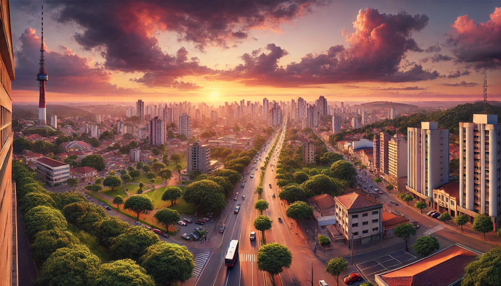

# The AI Portrait — Imagem Gerada por Inteligência Artificial 🎨🤖

## 📒 Descrição
Este projeto tem como objetivo explorar o poder das IAs Generativas na criação de imagens realistas e criativas. Para isso, utilizei uma IA para gerar uma imagem original de um avatar virtual com estilo futurista.

## 🤖 Tecnologias Utilizadas
- DALL·E (OpenAI) — Geração da imagem do avatar virtual.

## 🧐 Processo de Criação
1. Escolhi o tema: Imagem imitando uma fotografia real de Sorocaba/SP.

2. Descrevi em detalhes as características que gostaria na imagem.

3. Utilizei a IA DALL·E para gerar a imagem automaticamente.
4. 
## 🚀 Resultados
Imagem gerada pela IA:

## 💭 Reflexão
Foi interessante perceber como uma simples descrição bem feita pode gerar imagens com qualidade profissional usando IA. Este recurso pode ser muito útil em projetos criativos, design e identidade visual.
